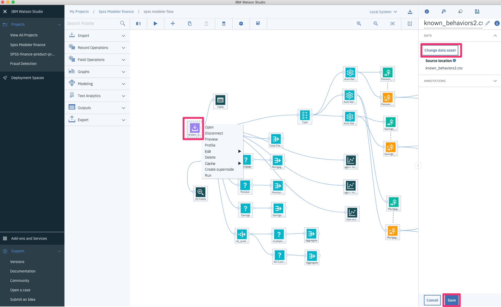
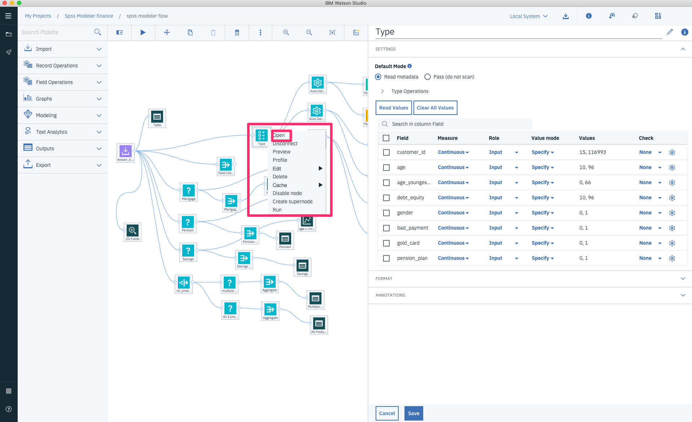

# Using IBM SPSS modeler to analyze and promote financial products to banking customers

Building, training and evaluating machine learning models can be done graphically using the SPSS Modeler flow feature in IBM® Watson™ Studio Desktop. IBM Watson SPSS Modeler flows in Watson Studio desktop provide an interactive environment for quickly building machine learning pipelines that flow data from ingestion to transformation to model building and evaluation, without needing any code.

This tutorial uses the SPSS Modeler components in IBM® Watson™ Studio Desktop to build, train and evaluate machine learning product-based classifier on customer profile to predict whether a customer would subscribe to a mortgage, savings, or pension account. As an alternative a user could use IBM Watson Studio in IBM Cloud.

We will be using existing financial data to train and evaluate the model that is available here:  https://github.com/IBM/spss-modeler-flow-finance/data

## Prerequisites

To complete this tutorial, you will need the following:

* IBM Watson Studio Desktop. You can download it from the link: https://www.ibm.com/products/watson-studio-desktop. You will be able to get a free trial version of IBM Watson Studio Desktop which also includes SPSS modeler flow feature.
* As an option to Watson Studio Desktop, you can use IBM Cloud and create services like IBM Watson Studio, IBM Watson Machine Learning Service, and IBM Cloud Object Storage to achieve the following in IBM cloud as well. For this you need to create an IBM Cloud account. You can obtain a free trial account by going to https://cloud.ibm.com if you don't already have one.

## Estimated time

It should take you approximately 60 minutes to complete this tutorial.

# Steps

Once you have the pre-requisites ready, you can now continue with the below steps. To understand basics about the SPSS modeler flow you can follow the following tutorial: https://developer.ibm.com/tutorials/watson-studio-spss-modeler-flow/

## Create model flow

Lets upload the initial flow and explore in the upcoming steps. After finishing the IBM Watson Studio Desktop installation perform the following:

1. Create a new empty project and provide a name.

2. Click **Add to Project** and select `Modeler Flow`. Select `From File` tab, provide name and description (optional) and upload the modeler flow (`finance-products-promotion.str`) thats available in https://github.com/IBM/spss-modeler-flow-finance/data . And finally click `Create` to create the modeler flow.

## Assign Data assets

To run the flow, you must first connect the flow with the appropriate set of test data available in your project.
1. Select the three dots of the Data Asset node to the left of the flow (the input node).
2. Select the Open command from the menu. This shows the attributes of the node in the right part of the page.

3. Click `Change data asset` to change the input file.

4. On the next page, select your .CSV file that contains the financial data, and click OK.

5. Click Save.

## Data Background

In 2016, a retail bank sold several products (mortgage account, savings account, and pension account) to its customers. It kept a record of all historical data, and this data is available for analysis and reuse. Following a merger in 2017, the bank has new customers and wants to launch some marketing campaigns.

From the historical data, you can train a machine learning product-based classifier on customer profile (age, income, account, ...) to predict whether a customer would subscribe to a mortgage, savings, or pension account. You can apply this predictive model to the new customer data and predict what product will they subscribe to.

## Understanding the Data

Below we will analyze the historical data of customers from year 2016. Since we are promoting financial products to customers, Let's see how many customers have subscribed to each product through the flow.

1. Select the three dots of the `Mortgage` data node. Its a `Select` type where you can select data with a condition like in a SQL query. Click Open.

2. As you can see there is a condition where `Mortgage = 1`. This will select all the customers who had bought `Mortgage` product. Click three dots again on `Mortgage` and select `Run`. This will give you the output by applying the condition to the dataset.

3. Select the three dots on the output and click `Open`. This will give you the result and shows the total count of `Mortgage` which means there are that many customer who bought the `Mortgage` product.

To find out how many customer bought `Savings` and `Pension` product you can follow the above steps for each of `Savings` and `Pension` select node.

Next is to find out how many customers bought multiple products

1. Click the three dot in `nb_product` derive node and click `Open`. You will see that in the expression field there is a formula for this new derived column. Its the sum of the values in each of Mortgage, Savings, and Pension field. A `1` in this field means that the customer has subscribed to this product else its `0`.

2. After the new field is run, we can now add a `Select` node where we can have a condition to select the rows where the new derived field (`nb_product`) has value greater than 1 which means these are the customers who bought more than one product. 

3. Click `Run` by selecting the three dots on the same derive node. And click `Open` on the output from the right panel to see the result. You will see a new derived field with the sum of the values.

4. The output shows the total count of customers who had bought more than one products.

Now we will find out how many customer bought all 3 products. 

1. From the same derive node we will connect it to a `Select` node and the condition for this use case would be to select the rows where the new derived field (`nb_product`) has value equal to 1.

2. Click `Run` by selecting the three dots on the same derive node. And click `Open` on the output from the right panel to see the result. You will see a new derived field with the sum of the values.

3. The output shows the total count of customers who had bought all 3 products.

## Understanding historical data through plotting

Using SPSS modeler flow, its possible to visualize the data using nodes of type `Graphs`.

Lets add few graph nodes to analyze visually. For Mortgage, lets analyze the members_in_household vs loan_accounts visually.

1. From the `Mortgage` Select node, connect it to a `Plot` graph. Click the three dots in the node and select open.
2. Choose X Field as `members_in_household` and Y field as `loan_accounts`. You can keep the rest as default. Click Save.

3. Click the three dots in `Plot` node again and click `Run`. Select the output and click `Open` to see the graph.

In the following visualization, you can see the behavior of the 2016 customers for the `Mortgage`. The darker color indicates that a customer bought a product;  The depth of the color indicates the number of purchases or non-purchases.

Same above approach can be applied to `Pension` and `Savings` to visualize using graphs.

From above analysis you can see that:
* The greater a customer's income, it's more likely that he or she will buy a savings account.
* The older a customer is, it's more likely that he or she will buy a pension account.
* There is a correlation between the number of people in a customer's household, the number of loan accounts held by the customer, and the likelihood a customer buys a mortgage account. To see the correlation, look at the upper right and lower left corners of the mortgage chart.

## Predicting 2017 customer behavior

In order to predict the future behavior of the customer we need to build and train a simple machine-learning algorithm to predict what the new clients will buy. We will be using the `Auto Classifier` node from the modeling category of the SPSS modeler. In this use case we will be creating three models one for each product.

1. We will be using `Type` node to understand the metadata of the data. The metadata shows what kind of data are we dealing with. The data could be `continuous`, `categorical`, `Flag`, `Nominal`, `Ordinal` and so forth.

2. Now lets prepare the data for creating 3 different models. We will be using `Auto Data Prep` node. This node will prepare the data for training and applying the machine learning algorithm.

3. Click the three dots in this node and click `Open`. In the `Fields` section, select field `Mortgage` as `Target` and add `age, income, members_in_household, loan_accounts` as `input fields`. Selecting Target as `Mortgage` means that we will be modeling the `Mortgage` field so that it can be predicted for future data.

4. Lets choose the algorithm for modeling. We will be using `Auto Classifier` node from the `Modeling` category and connect it to the `Auto Data Prep` node.  The `Auto Classifier` algorithm applies the top 3 best algorithm to create the model and chooses the best one among them. The top 3 algorithm is chosen based on the metric you select. In our case we are using the defaults.

5. Then click the three dots in  `Data Asset` node and click `Run` to apply the algorithm to create the machine learning model for `Mortgage` product.

6. After the building and training is done, the process will create a model node which can then be used for analysis and evaluation. Lets add a `Table` node and see the data after training. It creates two extra fields called `$XS_Mortgage_transmfored` an `$XSC_Mortgage_transmfored`. The The `$XS_Mortgage_transmfored` field is the predicted target value of the Autoclassifier node's ensemble of top 3 models.  The `$XSC_Mortgage_transformed` field is the "confidence" of the prediction for each record.

7. To evaluate the model, let's use the graph node `Evaluation`. Click three dots and select `Open`. Keep all the defaults as it will use the `_transformed` column for evaluation. And click `Run` on the same node.

To see the output select the output that it generates after clicking `Run`.

The above graph is a `Cumulative Gains chart` used to evaluate the model created. For cumulative charts, higher lines indicate better models, especially on the left side of the chart. In many cases, when comparing multiple models the lines will cross, so that one model will be higher in one part of the chart and another will be higher in a different part of the chart. In this case, you need to consider what portion of the sample you want (which defines a point on the x axis) when deciding which model to choose.  

Since the model is now created we are ready to apply the model to test data. Since the IBM Watson Studio Desktop doesn't allow to save the model, applying the model to test data is not part of this tutorial. You will need to use the perpetual version of Watson Studio Desktop.